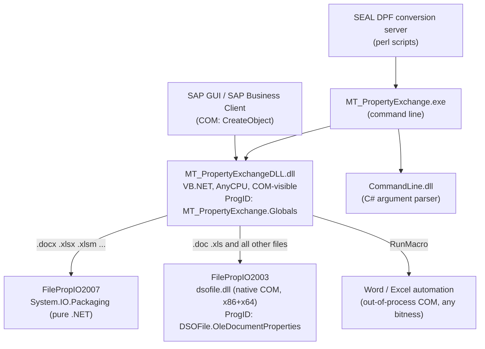

# MT_PropertyExchange — Architecture (technical reference)

*Deduced from the source code in this repository. See `docs/OVERVIEW.md` for
the business context and the main `README.md` for build/install steps.*

## Components



| Assembly / binary | Project | Role |
|---|---|---|
| `MT_PropertyExchangeDLL.dll` | `MT_PropertyExchange.dll/` (VB.NET) | Core library, exposed to COM. Strong-named (`key.snk`), registered with `regasm /codebase /tlb`. |
| `MT_PropertyExchange.exe` | `MT_PropertyExchange.exe/` (VB.NET) | Console wrapper; maps `-mode=...` switches onto the DLL API. |
| `CommandLine.dll` | `CommandLine/` (C#) | Command-line parsing helper used by the exe. |
| `dsofile.dll` | `Dsofile/` (C++) | Microsoft "DSO OLE Document Properties Reader 2.1". Native in-proc COM server; reads/writes OLE structured-storage property sets. Built for **Win32 and x64**. |
| `Interop.Dsofile.dll` | generated (`lib/`) | tlbimp-generated interop for dsofile, signed with `Dsofile/dsofile_key.snk` (a strong-named assembly may only reference strong-named assemblies). MSIL/AnyCPU. |
| `log4net.dll` | NuGet | Logging. |

## COM surface (`MT_PropertyExchange.Globals`)

- CLSID `{41A13AC0-103B-40EC-9A52-AEE2C6C846C6}`, assembly typelib GUID
  `{E13AAF33-8EC6-4C2D-8EA4-489560C6EB12}`, `ComClass` with auto-dispatch —
  late binding (`CreateObject`) is the intended usage.

| Member | Purpose | Returns |
|---|---|---|
| `ReadProperty(file, name)` | Read one property (`*` reads all) | value string |
| `WriteProperty(file, name, value)` | Write/create one property | error code |
| `DeleteProperty(file, name)` | Delete custom property / clear built-in | error code |
| `ExportProperties(file)` | Export all properties to a temp **XML** file | path of XML file |
| `ImportProperties(xmlFile, file)` | Import properties from XML | error code |
| `ImportPropertiesFromText(txtFile, file [, encoding])` | Import from `[PROPERTIES]` text file (default `utf-8`, e.g. `iso-8859-1`) | error code |
| `GetAllProperties(file [, delim])` | List property **names** | delimited string |
| `GetAllCusProperties(file [, delim])` | Dump `name<delim>value` lines to a temp Unicode text file (default delim `@\|`) | path of text file |
| `prAllProp` (property) | Path of the file created by the last `GetAllCusProperties` | string |
| `RunMacro(file, macro [, template], visible)` | Run a Word/Excel macro (Excel: loads a PLM add-in first) | error code |
| `InitializeLogging()` / `SetLogfile` / `SetLogLevel` / `ClearLogfile` | Logging control | – |
| `Version()` | Build identification string (overridable via `version-override.txt` next to the DLL) | string |
| `GetVersion()` | Marker of the "new" PMT Office DLL — SAP transaction ZBATIMP probes for this method (`FORM check_dlls`); must return exactly this value | literal `"V2"` |

### Error codes (`Globals.Errors`)

Also set as the **process exit code** of `MT_PropertyExchange.exe`.

| Code | Meaning |
|---|---|
| 0 | Success |
| -1 | Unknown error |
| 9000 | File not found |
| 9001 | File is read-only |
| 9002 | Invalid data (property conversion failed / bad import file) |
| 9003 | General automation error |
| 9004 | Unknown file extension |
| 9005 | Unknown mode switch (CLI) |
| 9006 | Missing parameter (CLI) |
| 9007 | Office macro not found / not executable |
| 9008 | File in use |
| 9009 | Encoding not supported |
| other | COM HRESULT passed through from Office/dsofile |

## Format handling strategy

`Globals.FilePropIOFactory` picks the implementation per file:

- **`FilePropIO2007`** — used when the file is a modern Office Open XML
  package (`.docx/.docm/.dotx`, `.xlsx/.xlsm/.xlam/.xlsb`, detected by
  extension). Pure .NET: opens the OPC container with `System.IO.Packaging`
  and manipulates two package parts directly, **without Office installed**:
  - *core properties* part (`docProps/core.xml`) for the built-ins — with
    name aliases `author→creator` and `comments→description`; recognized
    core names: `creator, subject, category, description, title, keywords`;
  - *custom properties* part (`docProps/custom.xml`, VT types) for
    everything else.
- **`FilePropIO2003`** — used for **all other files** (a deliberate change
  noted in the code: "handle ALL files other than Office 2007/2010 using
  DSOFile"). Uses the native `dsofile.dll` COM object
  (`DSOFile.OleDocumentProperties`) to access OLE structured-storage
  property sets (SummaryInformation / custom property sets) of `.doc`,
  `.xls` and any other OLE compound file. **This is the only native-code
  dependency and the reason the toolkit is bitness-sensitive.**
- **`RunMacro`** — independent of the above: automates Word/Excel via
  out-of-process COM (works with 32- or 64-bit Office regardless of caller
  bitness). Word: opens the document and runs the macro. Excel: probes a
  long list of add-in locations (`PT_Addin_01_PLM.xlam`,
  `MT_Addin_01_PLM.xlam`, `plmUpdateServer.xla` under Office `Library\pt|mt|vai`,
  `Primetals\Office`, `Siemens\MT\Office`, …), loads the first hit and runs
  `'<addin>'!<macro> <file>`.

## Data formats

**XML import/export** (`ExportProperties` / `ImportProperties`, also the
`test/fill_*.xml`, `empty_*.xml`, `delete_all.xml` samples and the real SAP
payload `test/PropertyUpdateFile.xml`). Format as delivered by SAP since the
2017 source level — upper-case tags, value as element text, optional
`<DOCUMENT>` wrapper (stripped on import):

```xml
<?xml version="1.0" encoding="utf-8" standalone="yes"?>
<DOCUMENT>
 <PROPERTIES>
 <PROPERTY Name="title">...</PROPERTY>
 <PROPERTY Name="DocumentNo">T.TEST....</PROPERTY>
 </PROPERTIES>
</DOCUMENT>
```

**Text import** (`ImportPropertiesFromText`, the format SAP/SEAL deliver):

```
[PROPERTIES]
Name=Value
Name2=Value2
```

**Text export** (`GetAllCusProperties`): temp file, one `Name@|Value` line
per property (delimiter configurable).

## Logging

log4net; configuration in `MT_PropertyExchangeLog.config` (deployed next to
the binaries). Default: `RollingFileAppender` → `%TMP%\PropertyExchange.log`,
level WARN, 5×10 MB rollover. The CLI can override at runtime
(`-loglevel=DEBUG -logfile=... -clearlog`); COM callers via
`SetLogLevel`/`SetLogfile`. The config file is located relative to the
installed assembly (probe order: CWD → assembly folder →
`%ProgramFiles(x86)%\Siemens\MT_PropertyExchange` → `%ProgramFiles%\...`).

## Bitness & registration model (the 64-bit port)

| Piece | Bitness | Registration |
|---|---|---|
| `MT_PropertyExchangeDLL.dll` | AnyCPU (one file) | `regasm /codebase /tlb` run **twice**: `Framework64\v4.0.30319` (64-bit view) and `Framework\v4.0.30319` (32-bit view) |
| `dsofile.dll` | two builds: `x86\` and `x64\` | `System32\regsvr32` for x64, `SysWOW64\regsvr32` for x86 — same CLSID, once per registry view |
| `MT_PropertyExchange.exe` | AnyCPU, `Prefer32Bit=false` | n/a (runs 64-bit on 64-bit Windows, hence uses the x64 dsofile) |
| Word/Excel automation | out-of-process | independent of caller/Office bitness |

A 64-bit client resolves `MT_PropertyExchange.Globals` in the 64-bit registry
view, loads the CLR + AnyCPU assembly in-process, which in turn creates
`DSOFile.OleDocumentProperties` resolved in the same (64-bit) view → x64
`dsofile.dll`. A 32-bit client gets the mirrored 32-bit chain. Both can be
installed simultaneously; the installer (`MTPropertyExchangeInstall/
install.bat`) performs all four registrations and verifies both chains with
`test/test-com.bat` (64-bit **and** 32-bit `cscript`).

## Repository guide

| Path | What it is |
|---|---|
| `MsoPropertyTransferUtils3.5.sln` | Main solution (DLL + EXE + CommandLine). Build `Release\|Any CPU`. |
| `MT_PropertyExchange.dll/` | Core VB.NET library. Key files: `Globals.vb` (COM class, factory, macro runner), `FilePropIO2007.vb` (OPC), `FilePropIO2003.vb` (DSOFile), `IFilePropIO.vb` (interface), `OfficeProps.vb` (property collection + XML/TXT serialization), `FileReadOnlyException.vb`. `FilePropDemo.vb`, `OfficePropserties.vb`, `ProjectData.cs`, `SAP2Word.cls` are leftovers **not** part of the build. |
| `MT_PropertyExchange.exe/` | Console wrapper. `MsoPropertyTransfer.vb` (arg handling + mode dispatch), `help.txt`/`dllhelp.txt` (embedded help, shown with `-help`/`-help-dll`). `MainModule.bas` is a VB6-era leftover, not built. |
| `CommandLine/` | C# argument parser (`Utility/Arguments.cs`). |
| `Dsofile/` | Microsoft DSOFile 2.1 C++ source; `dsofile.vcxproj`/`dsofile.sln` build x86+x64. `Lib/` holds the ODL/type library, `Res/` the resources. `dsofile_key.snk` signs the generated interop. The checked-in `Interop.dsofile.dll` is **unsigned** — do not reference it; the build generates a signed one into `lib/`. Old `.dsp/.dsw/.vcproj/.suo` files are kept for history only. |
| `lib/` | Target for the generated `Interop.Dsofile.dll` (see `lib/README.md`). |
| `MTPropertyExchangeInstall/` | Installer: `install.bat` (dual-bitness registration, logging, green/red result), `stage.bat` (collects build output), `uninstall.bat`, `unreg.bat`, `test/` (COM smoke test, `runTests.bat` round-trip tests, sample `SAP.doc/.docx/.xls/.xlsx`, sample import files). `test/MT_PropertyExchangeDLL_x64_hack.reg` is an **abandoned** DllSurrogate workaround — do not apply; remove its registry entries where it was ever used. |
| `make-installer.bat` + `7-zip/` | Builds the single self-extracting installer EXE (see `7-zip/README.md`). |
| `SEAL_Conversion/` | Historical SEAL DPF server working-unit scripts (reference only; not built or installed). |
| `docs/` | This documentation. |

## Known constraints

- `.doc`/`.xls` handling requires the registered native `dsofile.dll` of the
  **caller's bitness** — that is what the dual registration provides.
- `RunMacro` requires Microsoft Office on the machine; property read/write
  does **not** (OPC path is pure .NET, DSOFile path is self-contained).
- The DLL is strong-named; all referenced assemblies must be strong-named
  (log4net from NuGet is; the interop is signed during generation).
- `AssemblyVersion` is intentionally frozen at `1.0.0.0` so existing COM
  registrations stay valid across releases; identify builds via
  `AssemblyFileVersion` and `Globals.Version()`.
